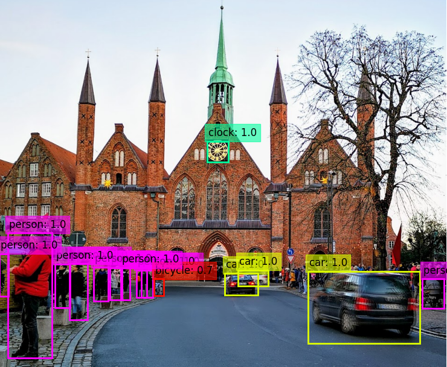

# **Real-Time Object Detection with YOLO[v3/v4]**

[[Original Project-Repo @Github ](https://github.com/Mnpr/Open-Detector)]

## :black_nib: Objective

To Compose/Implement :

- `YOLO[v4/v3]` algorithm on `MS COCO` dataset 
- Object Detection with Boundary Boxes
- Real-Time Detection. [ i.e. Videos/ Live-Cam ]

using `Python`, `OpenCV`, and `PyTorch`

## :books: SOTA Literatures

**YOLO Algorithms** 

- [[V4 Apr 2020](https://arxiv.org/pdf/2004.10934v1.pdf)],[[V3 Apr 2018](https://arxiv.org/pdf/1804.02767v1.pdf)],[[V2 Dec 2016](https://arxiv.org/pdf/1612.08242v1.pdf)], & [[V1 May 2016](https://arxiv.org/pdf/1506.02640v5.pdf)]

**Other Alt. Algorithms**

- [[EfficientDet Jul 2020 ](https://arxiv.org/pdf/1911.09070.pdf)], [[SpineNet Jun 2020](https://arxiv.org/pdf/1912.05027v3.pdf)], [[Detectron2](https://arxiv.org/pdf/1901.02446v2.pdf)],
  
  [[Swin Transformer Mar 2021](https://arxiv.org/pdf/2103.14030v1.pdf)],  [[UniverseNet Mar 2021 ](https://arxiv.org/pdf/2103.14027v1.pdf)], etc.

### :microscope: Components

- **Input** : Image 

- **Backbone** : [ VGG16, RESNET-50, DARKNET-52, RESNEXT-50 ]

- **Neck** : [ FPN, PAN, RBF ]

- **Detector Head** : 
  
  - One Stage Detectors [ RPN, YOLO, SSD ]
  - Two Stage Detectors [ Faster R-CNN, RFCN ]

## :file_folder: Dataset

**Microsoft COCO( Common Objects in Context ) Dataset 2017**

- [[ Data Source ]](https://cocodataset.org/#home)
- [[ COCO Paper ]](https://arxiv.org/pdf/1405.0312.pdf)
